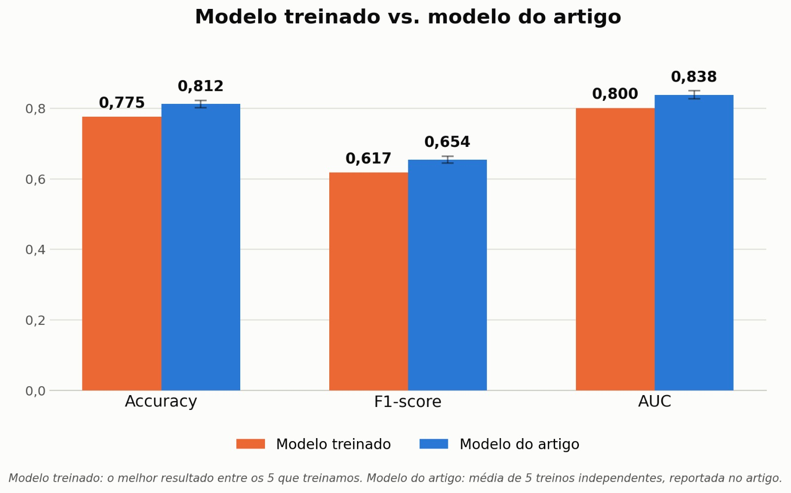

# Resultados do modelo base de pontuação

Primeira replicação da solução descrita no artigo associado ao conjunto de dados
fornecido pelo *Product Owner*, treinada em 12/09/2026 por
[Thales Germano Vargas Lima](https://github.com/thalesgvl).

Atende parcialmente a issue #4 — ver [Limitações](#limitacoes).

## Origem do conjunto de dados

O conjunto de dados foi disponibilizado pelo *Product Owner*, professor Vinícius
Rispoli, em 31/08/2026. Ele associa, a cada paciente, uma **tripla de imagens**
— os desenhos do relógio, do hexágono e do cubo — e um **score** único.

O conjunto **não contém** dados de pressão, inclinação, velocidade ou posição da
caneta. Na reunião de 31/08 o *Product Owner* confirmou que a análise do traçado
em tempo real está fora do escopo do projeto.

## Abordagem

Seguiu-se a arquitetura do artigo: três redes convolucionais extraem
características de cada uma das três imagens; as características são combinadas
por um mecanismo de atenção; a saída é o score.

Na mesma reunião, o *Product Owner* propôs uma **segunda estratégia**, ainda não
experimentada: como os desenhos são em escala de cinza, combiná-los em uma única
matriz de três canais, como se fossem uma imagem RGB, e treinar sobre um modelo
de grande porte com pesos pré-treinados. Fica registrada como próximo passo.

## Resultados

Foram realizados cinco treinos.

**Tabela 1:** Modelo treinado frente ao modelo do artigo

| Métrica | Modelo treinado | Modelo do artigo | Diferença |
|---------|:---------------:|:----------------:|:---------:|
| Acurácia | 0,775 | 0,812 | −0,037 |
| F1-score | 0,617 | 0,654 | −0,037 |
| AUC | 0,800 | 0,838 | −0,038 |

**Fonte:** [Thales Germano Vargas Lima](https://github.com/thalesgvl), 2026

### Como ler esta comparação

As duas colunas **não foram apuradas da mesma forma**, e a diferença importa:

- **Modelo treinado** — o *melhor* dos cinco treinos realizados.
- **Modelo do artigo** — a *média* de cinco treinos independentes, conforme
  reportado pelos autores.

Comparar o melhor resultado de um lado com a média do outro favorece o modelo
treinado. Ainda assim ele fica abaixo nas três métricas, o que significa que a
distância real entre a replicação e o artigo é **maior** do que a tabela indica.

Para uma comparação justa, o próximo ciclo deve reportar a **média e o desvio
dos cinco treinos** deste lado também.

## Limitações

Este registro documenta o resultado, mas ainda **não torna o treino
reproduzível**:

- O **script de treino não está neste repositório**. Sem ele, não é possível
  reexecutar o experimento nem auditar hiperparâmetros, divisão dos dados ou
  critério de seleção do melhor treino.
- Não há registro da divisão entre treino, validação e teste, nem da semente
  aleatória utilizada.
- A média e o desvio dos cinco treinos não foram registrados — apenas o melhor
  resultado.

Enquanto esses pontos não forem resolvidos, a issue #4 permanece parcialmente
atendida.

## Artefato

O arquivo de pesos tem aproximadamente 177 MB e, por isso, não é versionado
diretamente neste repositório — o GitHub recusa arquivos acima de 100 MB. Ele é
distribuído como anexo de *release*.

## Próximos passos

1. Publicar o script de treino neste repositório.
2. Reportar média e desvio dos cinco treinos, substituindo o melhor resultado.
3. Experimentar a estratégia de três canais proposta pelo *Product Owner*.
4. Exportar o modelo para execução no Android sem internet (issue #6).

## Histórico de versão

| Versão | Data | Descrição | Autor | Revisor |
|:------:|------|-----------|-------|---------|
| `1.0` | 20/09/2026 | Registro dos resultados do primeiro treino | [Thales Germano Vargas Lima](https://github.com/thalesgvl) | [Vitor Carvalho Pereira](https://github.com/vcpVitor) |
