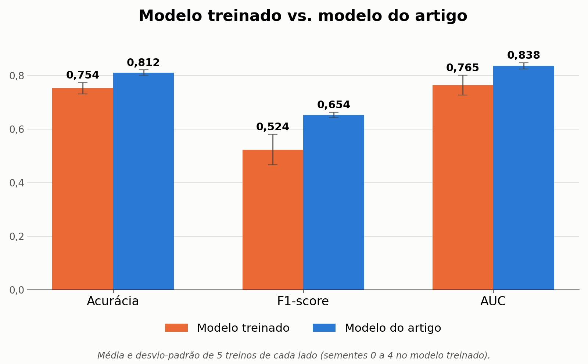

# Resultados do modelo base de pontuação

Primeira replicação da solução descrita no artigo associado ao conjunto de dados
fornecido pelo *Product Owner*, treinada entre 11 e 12/09/2026 por
[Thales Germano Vargas Lima](https://github.com/thalesgvl).

Atende parcialmente a issue #4 — ver [Limitações](#limitações).

## Origem do conjunto de dados

O conjunto de dados foi disponibilizado pelo *Product Owner*, professor Vinícius
Rispoli, em 31/08/2026. É o conjunto público do artigo *An explainable
self-attention deep neural network for detecting mild cognitive impairment using
multi-input digital drawing tasks*, publicado no repositório
[cccnlab/MCI-multiple-drawings](https://github.com/cccnlab/MCI-multiple-drawings).

Ele associa, a cada um dos 918 pacientes, uma **tripla de imagens** — o desenho do
relógio, a cópia do cubo e o teste de trilhas — e o **escore MoCA**. Como no
artigo, o paciente é classificado com comprometimento cognitivo leve (CCL) quando
o MoCA é menor que 25.

O conjunto **não contém** dados de pressão, inclinação, velocidade ou posição da
caneta. Na reunião de 31/08 o *Product Owner* confirmou que a análise do traçado
em tempo real está fora do escopo do projeto.

## Abordagem

Seguiu-se a arquitetura do artigo: três redes convolucionais VGG16, pré-treinadas
no ImageNet, extraem características de cada uma das três imagens; as
características são combinadas por três camadas de autoatenção; a saída é a
probabilidade de o paciente ter CCL. O treino usa o rótulo suave do artigo,
y = 1 − sigmoide(MoCA − 24,5).

Na mesma reunião, o *Product Owner* propôs uma **segunda estratégia**, ainda não
experimentada: como os desenhos são em escala de cinza, combiná-los em uma única
matriz de três canais, como se fossem uma imagem RGB, e treinar sobre um modelo
de grande porte com pesos pré-treinados. Fica registrada como próximo passo.

## Resultados

Foram realizados cinco treinos com a configuração do artigo, um para cada semente
aleatória (0 a 4). Cada semente gera uma divisão estratificada de 70/15/15: 642
pacientes para treino, 138 para validação e 138 para teste (40 com CCL e 98
saudáveis), sem paciente repetido entre os conjuntos. Cada treino tem 100 épocas, e
o modelo avaliado é o da última época, como no artigo.

**Tabela 1:** Modelo treinado frente ao modelo do artigo (média ± desvio-padrão de cinco treinos)

| Métrica | Modelo treinado | Modelo do artigo | Diferença |
|---------|:---------------:|:----------------:|:---------:|
| Acurácia | 0,754 ± 0,021 | 0,812 ± 0,010 | −0,058 |
| F1-score | 0,524 ± 0,057 | 0,654 ± 0,010 | −0,130 |
| AUC | 0,765 ± 0,037 | 0,838 ± 0,012 | −0,073 |

**Fonte:** [Thales Germano Vargas Lima](https://github.com/thalesgvl), 2026; modelo do artigo: Tabela 1 do artigo, modelo proposto.

**Tabela 2:** Resultado de cada treino, no conjunto de teste

| Semente | Acurácia | F1-score | AUC |
|:-------:|:--------:|:--------:|:---:|
| 0 | 0,739 | 0,486 | 0,722 |
| 1 | 0,775 | 0,617 | 0,800 |
| 2 | 0,732 | 0,448 | 0,738 |
| 3 | 0,739 | 0,538 | 0,747 |
| 4 | 0,783 | 0,531 | 0,818 |

**Fonte:** [Thales Germano Vargas Lima](https://github.com/thalesgvl), 2026

### Como ler esta comparação

As duas colunas da Tabela 1 agora são apuradas da mesma forma: a média de cinco
treinos com divisões diferentes dos dados. A versão anterior deste documento
comparava o treino da semente 1, o de melhor F1-score, com a média do artigo, o que
favorecia o modelo treinado.

O modelo treinado fica abaixo do artigo nas três métricas, e a distância é maior
que a variação entre os treinos do próprio artigo. Isso indica uma diferença de
método, e não só sementes desfavoráveis.

A causa mais provável é o **sobreajuste**: em todos os cinco treinos, o melhor AUC
de validação aparece entre as épocas 7 e 17, e depois a validação para de melhorar
enquanto o erro de treino continua caindo. As três VGG16 são ajustadas por inteiro
(cerca de 46 milhões de parâmetros) com só 642 pacientes de treino. O artigo não
diz se as VGG16 foram congeladas ou ajustadas.

Também foi treinada uma variação com ajustes além do artigo (amostragem balanceada
por classe, escolha do modelo pelo melhor AUC de validação, AdamW com agenda de
taxa de aprendizado, aumento de dados, *embeddings* posicionais e quatro cabeças de
atenção). Ela ficou abaixo da configuração do artigo nas três métricas:
0,736 ± 0,023 de acurácia, 0,450 ± 0,102 de F1-score e 0,754 ± 0,045 de AUC.

## Limitações

Este registro documenta o resultado, mas ainda **não torna o treino
reproduzível** a partir deste repositório: o **script de treino ainda não está
aqui**. Sem ele, não é possível reexecutar o experimento nem auditar os
hiperparâmetros. As sementes, a divisão dos dados e o critério de escolha do
modelo estão registrados acima.

Enquanto o script não for publicado, a issue #4 permanece parcialmente atendida.

## Artefato

O arquivo de pesos tem cerca de 185 MB e, por isso, não é versionado diretamente
neste repositório — o GitHub recusa arquivos acima de 100 MB. Ele será anexado a
uma *release* depois que o *Product Owner* autorizar a publicação: o repositório de
origem dos dados não declara licença, e os pesos são derivados deles.

## Próximos passos

1. Publicar o script de treino neste repositório.
2. Treinar com as VGG16 congeladas, ajustando só a autoatenção e o classificador,
   para atacar o sobreajuste com uma mudança isolada.
3. Experimentar a estratégia de três canais proposta pelo *Product Owner*.
4. Exportar o modelo para execução no Android sem internet (issue #6).

## Histórico de versão

| Versão | Data | Descrição | Autor | Revisor |
|:------:|------|-----------|-------|---------|
| `1.0` | 20/09/2026 | Registro dos resultados do primeiro treino | [Thales Germano Vargas Lima](https://github.com/thalesgvl) | [Vitor Carvalho Pereira](https://github.com/vcpVitor) |
| `1.1` | 04/10/2026 | Correção com os dados registrados do treino: média e desvio dos cinco treinos, resultado por semente, divisão dos dados, origem do conjunto e variação `improved` | [Thales Germano Vargas Lima](https://github.com/thalesgvl) | A definir |
